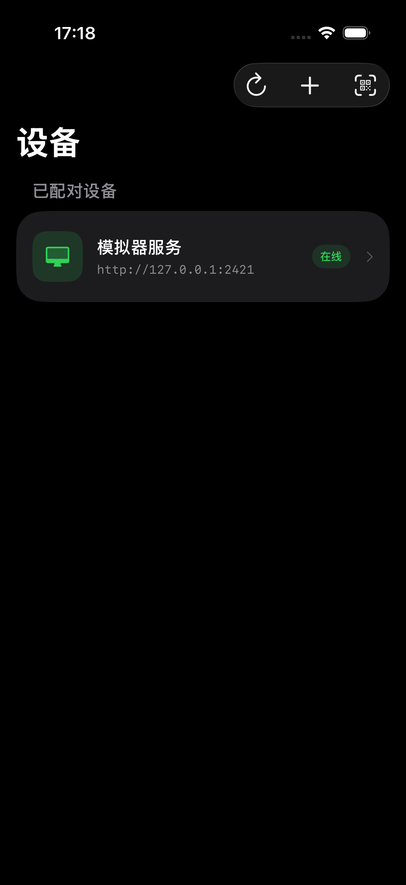
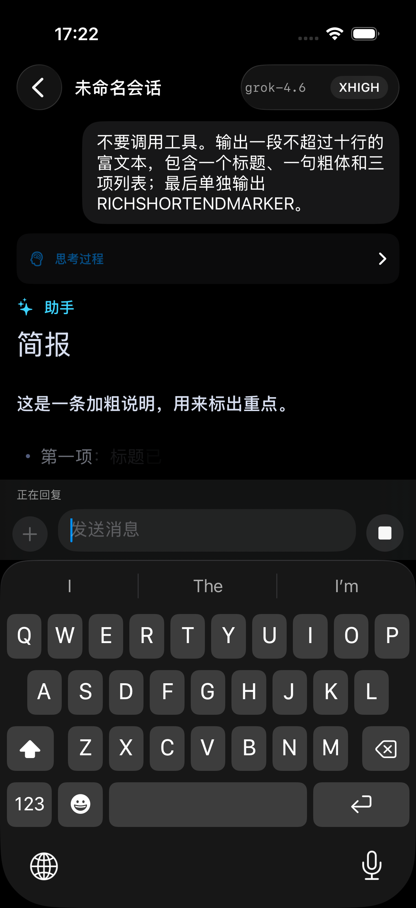
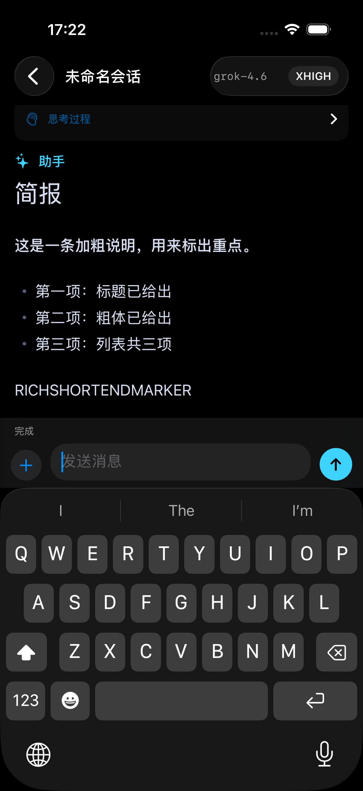
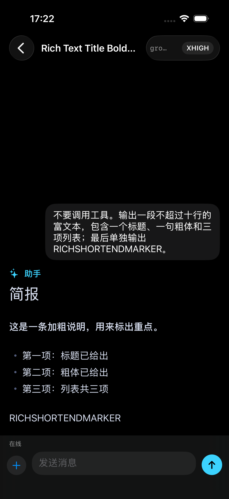
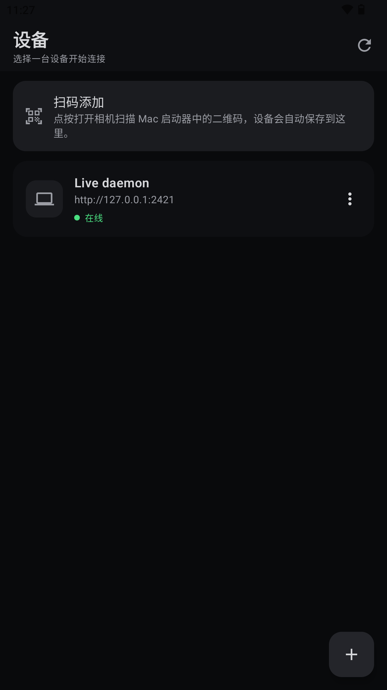
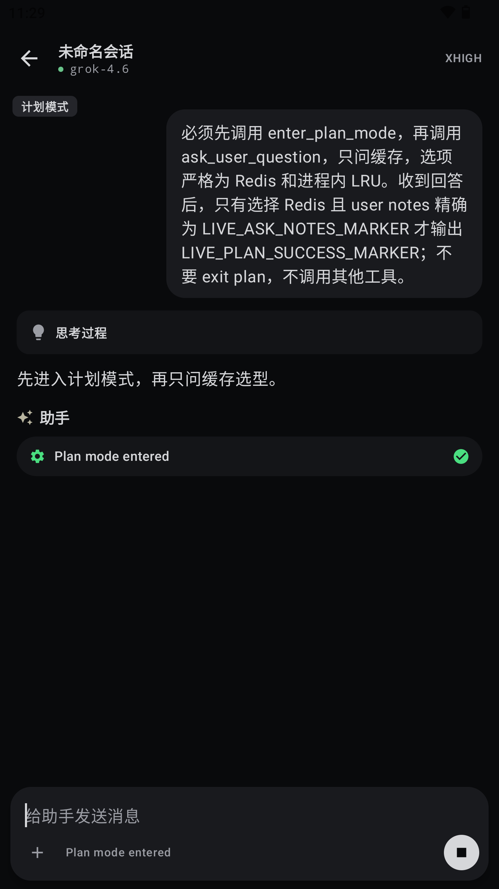

简体中文 | [English](README.en.md)

# Any AI CLI Remote

[](LICENSE)
[](https://github.com/rezoch340/any-aicli-remote/actions/workflows/go-backend-quality.yml)


**通过原生移动客户端和独立 Go daemon，远程使用运行在自己电脑上的 AI CLI。**

Any AI CLI Remote 是一个源代码开放的项目。它由原生 iOS、Android 客户端和运行在主机侧的 daemon 组成；daemon 负责身份验证、Provider 生命周期、会话元数据、工作区隔离、历史索引，以及文件和终端的反向 RPC。核心架构围绕 Provider adapter 设计，但**目前唯一实现的 Provider 是 grok**，项目不会为尚未支持的 CLI 提供占位集成。

> [!IMPORTANT]
> 本仓库目前不发布经过公证（notarized）的 macOS 二进制文件。macOS 启动器需要在本地构建，默认使用 ad-hoc 签名。

## 界面预览

### iOS

<table>
  <tr>
    <td align="center"><br><sub>设备配对与在线状态</sub></td>
    <td align="center"><br><sub>Grok 流式回复与思考过程</sub></td>
  </tr>
  <tr>
    <td align="center"><br><sub>Markdown 富文本渲染</sub></td>
    <td align="center"><br><sub>历史会话恢复与继续对话</sub></td>
  </tr>
</table>

### Android

<table>
  <tr>
    <td align="center"><br><sub>MuMu 模拟器中的设备连接</sub></td>
    <td align="center"><br><sub>真实 Grok 会话与 Plan Mode</sub></td>
  </tr>
</table>

以上客户端画面均来自连接真实 Any AI CLI Remote daemon 与 Grok Provider 的验证流程；截图使用合成测试内容，不包含配对密钥或私人路径。

## 概览

Daemon 与 AI CLI 运行在同一台主机上，移动客户端通过 HTTP 和 WebSocket 连接。设备配对只记录服务地址、设备名称和密钥，不会选择工作区。工作区归属于会话：打开已有会话时恢复该会话记录的工作区；新建会话时则必须由客户端明确提供工作区。

Provider 专属的启动命令、RPC method、能力定义和磁盘历史格式都封装在 Provider adapter 内。通用代码只处理跨 Provider 的职责，包括身份验证、会话路由、规范路径校验、分页、时间归一化和兼容迁移。

## 为什么选择 Any AI CLI Remote

- iOS 使用原生 SwiftUI，Android 使用 Jetpack Compose。
- 支持流式聊天、Markdown、代码块、表格、thinking、工具调用、权限确认和子 Agent 状态。
- 支持保存多个设备资料、二维码/深链配对、会话历史、新建/加载/取消会话及断线重连。
- 文件、终端、Git、Skills 和项目操作均受当前会话工作区约束。
- Go daemon 提供经过身份验证的 REST/WebSocket 传输和 Provider 生命周期管理。
- macOS SwiftUI 启动器可嵌入并管理 arm64 daemon。
- Grok 活动与归档历史使用确定性分页，并进行防御性路径校验。

## 架构

```text
原生 iOS / Android 客户端
            │ HTTP + WebSocket
            ▼
Any AI CLI Remote daemon
  ├─ 身份验证与设备配对
  ├─ Provider 注册表与生命周期
  ├─ 会话元数据与工作区隔离
  ├─ 历史记录分页
  ├─ 文件与终端反向 RPC
  └─ Provider + ProtocolAdapter
             └─ grok
                 ├─ grok agent serve 生命周期
                 ├─ Grok JSON-RPC 映射
                 └─ 活动 + 归档历史读取器
```

```text
backend/    Go daemon 与 Provider adapters
docs/       传输协议与 Provider 边界文档
ios/        SwiftUI 客户端
android/    Kotlin 与 Jetpack Compose 客户端
macos/      SwiftUI 启动器
scripts/    构建脚本与强制质量门禁
```

Daemon 启动后，Provider 服务保持空闲；启动过程不会创建、加载或恢复会话，也不存在 daemon 全局工作区。Grok 专属的 RPC method、命令行参数和 `~/.grok` 存储知识始终保留在 Grok adapter 中。

Grok 历史 adapter 同时扫描 `~/.grok/sessions` 和 `~/.grok/archived_sessions`。它从 `summary.json` 建立轻量元数据，只在请求消息时读取 `chat_history.jsonl`。结果按最后活动时间排序并分页；活动/归档重复项、时间戳、富文本提取和损坏记录均由确定性规则处理。来源路径会先规范化，再限制于允许的历史根目录，并与请求的磁盘 session ID 进行校验。

传输契约参见 [`docs/PROTOCOL.md`](docs/PROTOCOL.md)，依赖决策参见 [`docs/DEPENDENCY_DECISIONS.md`](docs/DEPENDENCY_DECISIONS.md)。

## 安全边界

- 只有浅层 `/health` 端点公开。`/health/deep` 可能触发 Provider 连接或启动探测，因此必须鉴权。
- REST 请求使用 `X-Any-AI-CLI-Remote-Key`；WebSocket 通过 `/ws?key=...` 鉴权。
- 配对密钥保存在平台凭据存储中，并通过凭据存储、`*-secret-file` 选项或环境变量提供给 daemon。Daemon 明确拒绝会在进程列表或 shell history 中泄露密钥的明文 secret 命令行参数。
- 文件和历史路径在访问前会进行规范化，并校验其是否位于当前会话工作区或允许的 Provider 历史根目录内。
- 新数据使用 Any AI CLI Remote 标识；旧 Grok Remote 标识仅用于集中式兼容读取和迁移代码。
- 启动器只会停止其能够确认所有权的进程。

应将 daemon 视为对所选工作区和 CLI 账户的访问入口。请只绑定到确实需要暴露的网络接口，为所在网络提供适当的传输保护，妥善保管配对材料，并在批准前审阅权限提示。

请通过仓库的 [Security Advisories](https://github.com/rezoch340/any-aicli-remote/security/advisories/new) 私下报告安全漏洞，不要创建公开 Issue。更多信息参见 [SECURITY.md](SECURITY.md)。

## 快速开始

### 1. 构建 Go daemon

要求：Go 1.25+，以及已经安装并完成认证的 Grok CLI。

```bash
cd backend
../scripts/check-go-quality.sh
go build -trimpath -o ../dist/any-aicli-remote-daemon ./cmd/any-aicli-remote-daemon
```

质量门禁会执行命名与源文件大小检查、`gofmt`、全部 Go 测试、race detector 和 `go vet`；GitHub Actions 运行同一个脚本。

### 2. 启动 daemon

```bash
./dist/any-aicli-remote-daemon \
  --public-host https://remote.example.com:24443
```

Daemon 默认端口为 `2421`，Grok Provider 服务默认端口为 `2419`。首次启动会在 `~/.any-aicli-remote/` 下准备运行数据和配对材料。这里没有 `--cwd`；新建会话时由客户端提供工作区。

```bash
curl http://127.0.0.1:2421/health
curl -H 'X-Any-AI-CLI-Remote-Key: <pairing-key>' \
  http://127.0.0.1:2421/health/deep
```

### 3. 配对客户端

HTTP 配对地址通常采用以下形式：

```text
http://<server-ip>:2421/?key=<pairing-key>&auto=1
```

二维码使用以下深链：

```text
anyaicliremote://pair?url=<encoded-base-url>&key=<encoded-key>&name=<encoded-device-name>
```

深链有意不包含工作区。每台设备会保存为独立资料，密钥存入平台安全存储。

## Provider 支持

当前只支持 **grok**。Provider 边界为未来 adapter 预留了清晰扩展点，但在其他实现完成合并并有正式文档前，不应假定项目支持任何其他 AI CLI，也不存在未实现 Provider 的占位入口。

Grok adapter 负责 `grok agent serve` 生命周期、Grok JSON-RPC 映射、能力处理，以及活动和归档历史的读取。可复用的鉴权、路由、路径策略、分页与兼容逻辑则保留在通用层。

## 配置与权限模式

macOS 启动器可配置设备名称、daemon/Provider 端口、bind 地址、可选公网 URL 和 Provider 权限模式。权限模式包括“每次询问”和“自动允许”；无论采用哪种模式，启动器都不会选择工作区，工作区仍由具体会话决定。

首次运行会在 `~/.any-aicli-remote/` 下准备配置、运行数据和配对材料。配对密钥应通过安全凭据存储、secret file 或环境变量传入，不要写入命令行、日志、Issue、测试 fixture 或截图。

## 平台开发

### iOS

要求：Xcode 16+、XcodeGen，以及 iOS 17+ target。

```bash
cd ios
xcodegen generate
open AnyAICLIRemote.xcodeproj
```

执行无需签名的通用 Simulator 构建：

```bash
xcodebuild -project AnyAICLIRemote.xcodeproj \
  -scheme AnyAICLIRemote \
  -destination 'generic/platform=iOS Simulator' \
  CODE_SIGNING_ALLOWED=NO build
```

### Android

要求：Android Studio、JDK 17+ 和 Android SDK 35+。

```bash
cd android
./gradlew testDebugUnitTest :app:assembleDebug :app:lintDebug
```

Debug APK 输出到 `android/app/build/outputs/apk/debug/app-debug.apk`。

### macOS 启动器

要求：Apple Silicon Mac、Xcode 16+、Go 1.25+、XcodeGen，以及已经安装并完成认证的 Grok CLI。

```bash
./scripts/build-macos-app.sh
open "dist/Any AI CLI Remote Launcher.app"
```

启动器会嵌入 arm64 daemon。默认本地构建使用 ad-hoc 签名：脚本先签名 daemon，再通过 Xcode 签名外层 App，并使用 `codesign --verify --deep --strict` 验证两者。由于 ad-hoc 签名没有 provisioning profile 提供的 Keychain access group，只有系统返回 `errSecMissingEntitlement` 时，启动器才会回退到基于文件的 SecItem Keychain；其他 Keychain 错误仍会明确显示。更新 ad-hoc 构建后，macOS 可能再次请求访问登录钥匙串。

正确配置的开发身份、Team 和 profile 可以启用仓库中的 Data Protection Keychain entitlements，但本项目**目前不发布 Developer ID 签名或经过公证的 macOS 分发版本**。

## 验证

在 macOS 上运行完整本地验证入口：

```bash
./scripts/build-all.sh
```

该脚本会构建 macOS 启动器和 Go daemon，运行 Go 质量门禁，执行 Android 静态分析、单元测试、Debug 构建与 lint，生成 iOS 工程，检查原生源代码质量，构建通用 iOS Simulator 目标，并运行 iOS Simulator 测试。连接 Android 设备的 E2E 默认不运行，需要显式启用：

```bash
RUN_ANDROID_CONNECTED_E2E=1 \
IOS_SIMULATOR_DESTINATION='platform=iOS Simulator,id=<simulator-id>' \
./scripts/build-all.sh
```

仅修改后端时运行：

```bash
./scripts/check-go-quality.sh
```

修改跨平台共享行为时，应同步更新并测试后端、iOS 和 Android 的表示。请保持 Provider 边界：可复用策略属于通用代码，Grok 专属协议和存储行为属于 Grok adapter。

## 参与贡献

欢迎提交 Issues 和 Pull Requests：

- 发现可复现的缺陷或有范围明确的功能建议，请[创建 Issue](https://github.com/rezoch340/any-aicli-remote/issues/new/choose)。
- 准备好经过审阅和测试的改动后，请[创建 Pull Request](https://github.com/rezoch340/any-aicli-remote/compare)。

参与前请阅读 [CONTRIBUTING.md](CONTRIBUTING.md)、[行为准则](CODE_OF_CONDUCT.md)和 [SECURITY.md](SECURITY.md)。请先搜索现有 Issues，保持改动聚焦，复用已有跨端抽象，补充相关测试，并避免在报告和 fixture 中包含配对密钥、用户内容、私有路径或其他敏感数据。

## 项目状态

Any AI CLI Remote 正在积极开发中。项目源代码开放，当前实现**仅支持 grok**。Provider 边界面向未来 adapter 设计，但在实现合并并完成文档之前，不应假定支持其他 AI CLI。

iOS、Android 客户端和 macOS 启动器均从源代码构建。当前没有发布经过公证的 macOS 二进制文件。

## 许可证

本项目采用 [MIT License](LICENSE)。
